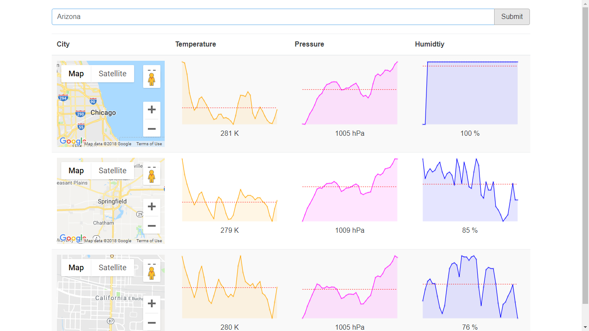

This application is used to forecast weather for the next five days(includes temperature, pressure & humidity).
Using react and redux combined .Also used API of Google maps and OpenWeatherApp to forecast weather
Used axios to fetch the request and lodash to take the average of five day weather.

